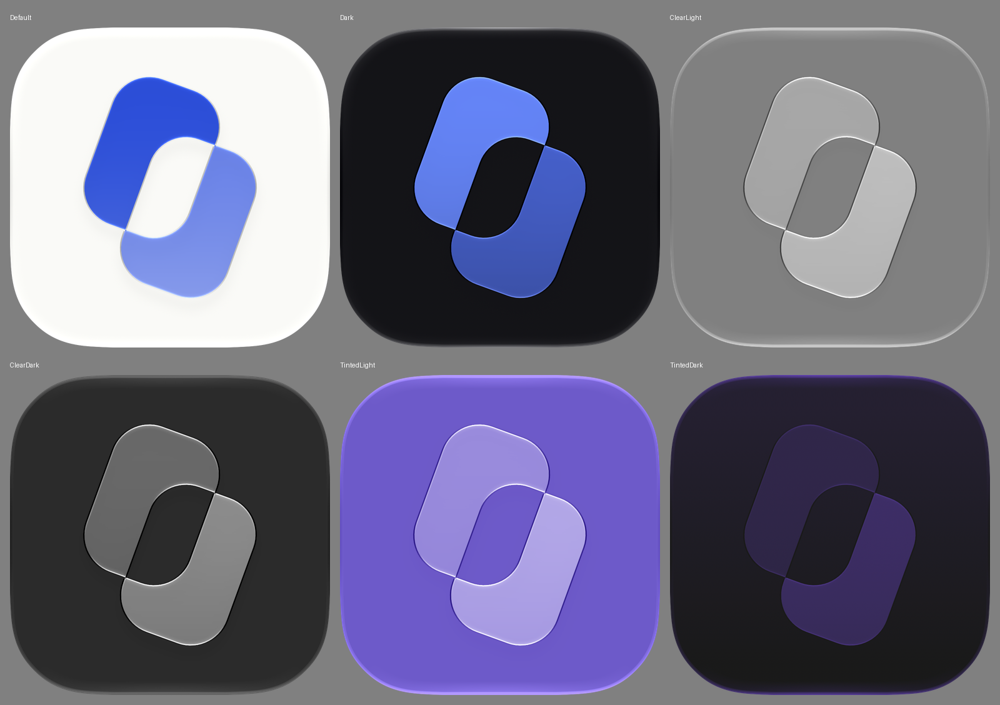
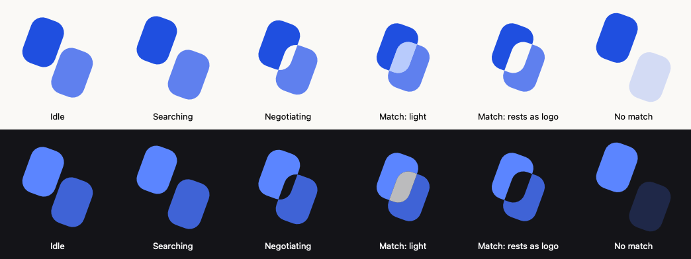

# Starling brand

<picture><source media="(prefers-color-scheme: dark)" srcset="starling-logo-knockout-dark.svg"></picture>

## The mark: the Overlap

Two rounded rectangles, rotated 20 degrees and offset diagonally. The region where they overlap is knocked out: truly transparent, cut from both shapes, never a painted patch.

**Meaning.** The two shapes are two people. Starling only ever shares the overlap between them (mutual time, mutual interest), and nothing is shared until both say yes. The empty overlap is that promise. At small sizes the knockout also reads as a stylized "S".

**Geometry**, in logo units (the icon canvas is 1024 px, one unit is 123.29 / 14 px):

| | |
|---|---|
| Each shape | 40 by 56, corner radius 14 (circular corners) |
| Rotation | 20 degrees clockwise, about the canvas center |
| Logo pose | Shape centers at (-10, -8) and (10, 8) in the rotated frame, so the overlap is centered |

`Packages/StarlingDesign` (`MarkGeometry`) is the code version of this table, and a test keeps it aligned with the icon layers.

## Colors

| Token | Light | Dark |
|---|---|---|
| Shape A | `#1F4FE0` | `#5B85FF` |
| Shape B | `#5F80EE` | `#3F63D6` |
| Background | `#FAF9F6` | `#141418` |
| Match light (status mark only) | `#9DB8FF` | `#FFFFFF` |

Contrast of each shape against its background (WCAG 2.x, checked in `MarkPaletteTests`):

| | Light | Dark |
|---|---|---|
| Shape A | 6.13:1 | 5.46:1 |
| Shape B | 3.43:1 | 3.47:1 |
| A against B | 1.79:1 | 1.57:1 |

Both shapes clear 3:1 in both appearances. The earlier shape B, `#7C98F2`, was 2.61:1 on the light background, which is why it changed.

On GitHub's dark background (`#0D1117`), light shape A is only 2.93:1, so the repo README switches to the dark logo under a dark color scheme.

## Files

| File | What it is |
|---|---|
| `App/Resources/Starling.icon` | The app icon, an Icon Composer bundle (ADR 0170). Edit it in Icon Composer, not by hand. |
| `starling-logo-knockout.svg`, `starling-logo-knockout-dark.svg` | Flat logo for places without Liquid Glass (README, web, slides). The overlap is cut with an SVG mask. |
| `previews/icon-*.png` | The app icon in all six iOS appearances, rendered by Icon Composer's `ictool` |
| `previews/icon-appearances.png` | The six appearances on one sheet |
| `previews/shadow-gap-0.5-vs-0.2.png` | The gap at the delivered shadow opacity and at the chosen one (ADR 0171) |
| `previews/status-mark-states.png` | The status mark in each state, light and dark, rendered from `StarlingDesign` with `ImageRenderer` |
| `tools/icon_previews.py` | Re-renders the icon previews and prints the measurements below |

AppKit's SVG renderer (`NSImage`) rasterizes the flat logo's mask at the SVG's native 64 by 82 size, so the knockout edge looks soft when scaled up. Browsers and WebKit render it sharp. In the app, draw the mark with `StarlingDesign` instead of loading the SVG.

## App icon

One Liquid Glass group ("Overlap") with both layers. Glass on for both layers, specular on, neutral shadow at 20 percent (lowered from 50, ADR 0171), dark fills per layer, light and dark backgrounds from the table above.

Measured by `python3 docs/brand/tools/icon_previews.py` (Xcode 27.0 `ictool`, 1024 px, default tint). Gap columns compare the knocked-out overlap, 8 px in from its edge, with the icon background; Delta E around 2.3 is just noticeable.

| Appearance | Gap dE p95 | Gap dE max | Gap pixels shadowed | A | B | A vs B dE | A vs B contrast |
|---|---|---|---|---|---|---|---|
| Default | 2.1 | 2.9 | 2.3% | #2D4FD9 | #7D93E9 | 42.6 | 2.23:1 |
| Dark | 1.5 | 2.2 | 0.0% | #6483F6 | #3E55B2 | 20.6 | 1.94:1 |
| Clear light | 0.8 | 0.8 | 0.0% | #A7A7A7 | #B6B6B6 | 5.6 | 1.19:1 |
| Clear dark | 0.9 | 0.9 | 0.0% | #696969 | #808080 | 9.2 | 1.39:1 |
| Tinted light | 0.8 | 0.9 | 0.0% | #998BDC | #AA9EE3 | 9.9 | 1.23:1 |
| Tinted dark | 3.1 | 4.9 | 0.0% | #302749 | #382C5C | 9.4 | 1.11:1 |

- **Gap:** clean in every appearance. No gap pixel is darker than the background except the 2.3 percent in default light. Tinted dark's higher Delta E comes from the system's background gradient (the two background samples differ), not from shadow: no gap pixel is darker than the background there.
- **A and B in tinted and clear:** distinct in all four (Delta E 5.6 to 9.9, where 2.3 is just noticeable), and the glass rims outline each shape. Tinted dark is the weakest at 1.11:1. The system derives tinted and clear colors from luminance, so this is where to look first if the owner wants more separation; Icon Composer can override layer settings for the Mono appearance, which covers clear and tinted.

## Status mark

`StarlingDesign.StatusMark(state:)` animates the mark for Down status (ADR 0172):

| State | Motion |
|---|---|
| Idle | Apart |
| Searching | Your shape (A) pulses; both drift |
| Negotiating | Shapes slide in; the gap opens |
| Match | The gap fills with light, then fades; the mark rests as the logo |
| No match | They drift apart and the other shape fades. No sound, no message. |

The knockout is drawn live with the even-odd rule, so it works at any position. The animated mark never uses `glassEffect` or `GlassEffectContainer`: glass shapes merge when close and would fill the gap. Glass is for the app icon and controls only. Under Reduce Motion the states crossfade. `StatusMarkGlyph(.apart | .close | .logo)` gives still poses for a future Dynamic Island.

## Rejected directions

Do not reintroduce these:

- Bird silhouettes
- Star or sparkle shapes
- Overlapping circles (reads as Mastercard)
- Purple or teal gradients
